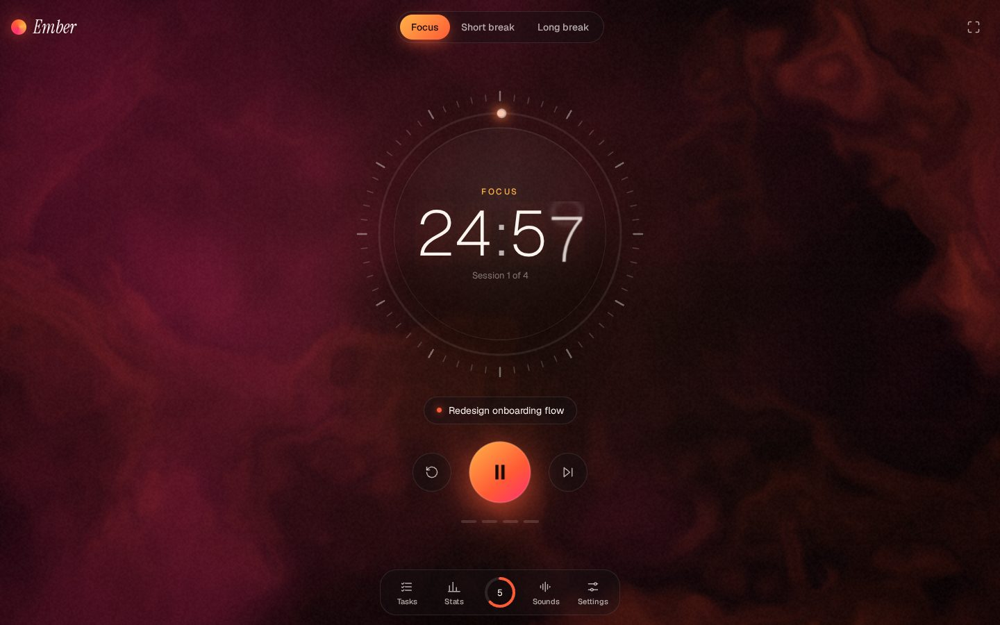
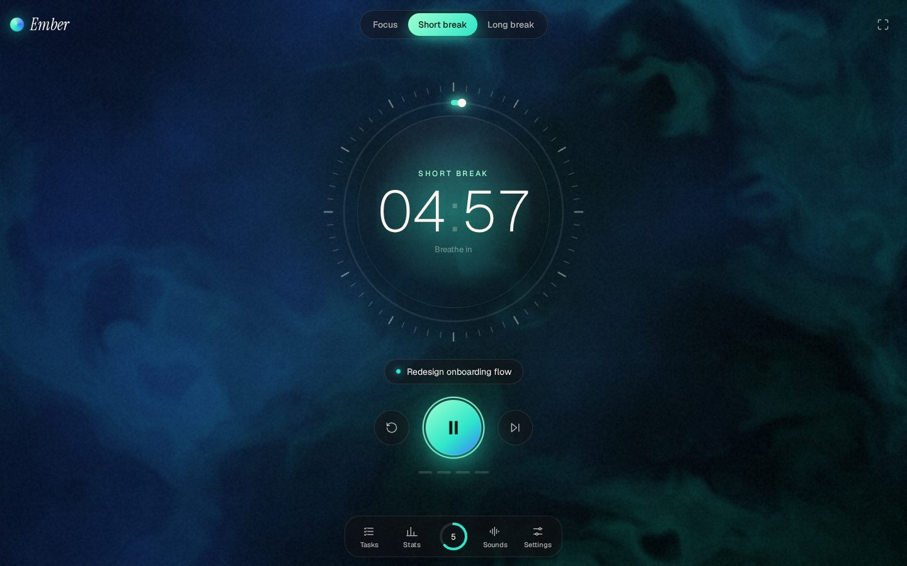
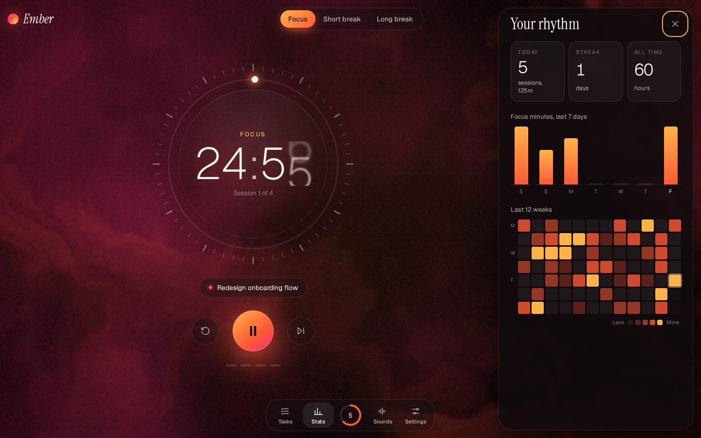
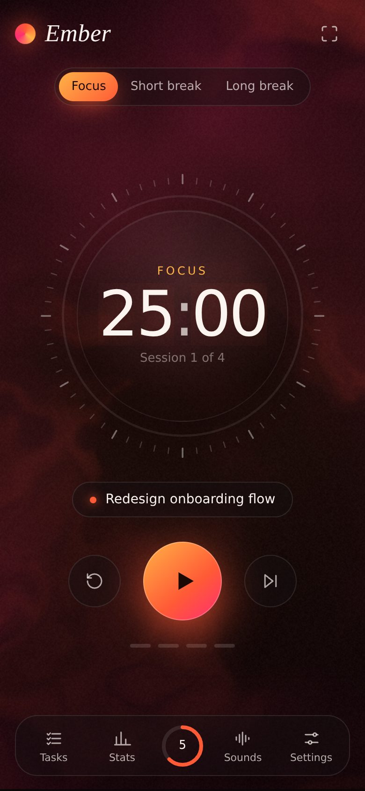

# Ember

A calm, beautiful Pomodoro timer for desktop and mobile. A live WebGL shader fills the screen behind the timer, and its light shifts with each mode: ember-warm while you focus, cool teal on short breaks, violet on long ones.



| Break with breathing guide | Stats | Mobile |
| --- | --- | --- |
|  |  |  |

## Features

- **Pomodoro cycle**: focus, short break and long break, with a long break every N sessions. Times come from wall-clock timestamps, so the countdown stays accurate in background tabs and survives a page reload.
- **Living backdrop**: a domain-warped noise shader that eases between palettes, speeds up while the timer runs, glows brighter as the session nears its end and drifts with the pointer. It slows to near-still under `prefers-reduced-motion`.
- **Motion details**: rolling digits, a 60-tick dial that lights up as time passes, a sliding mode pill, a shockwave when a session ends.
- **Tasks**: estimate sessions per task, pick one to focus on, and finished sessions are credited to it. It also estimates when your list will be done.
- **Stats**: today, streak, all-time hours, a 7-day bar chart and a 12-week heatmap.
- **Soundscapes**: rain, brown noise, ocean and drone, all synthesized live with the Web Audio API (no audio files), plus completion chimes and an optional tick.
- **Breathing guide** on breaks (4s in, 4s hold, 6s out).
- **Zen mode** (`Z`) hides everything but the dial.
- **Daily goal** ring in the dock.
- **Progress favicon and tab title**, desktop notifications, haptics on mobile, and a screen wake lock while running.
- **Installable PWA** that works offline.
- **Keyboard**: `Space` start/pause · `R` reset · `S` skip · `1` `2` `3` modes · `Z` zen · `T` `I` `M` `,` panels · `Esc` close.

Everything is stored locally in the browser. No accounts, no tracking.

## Stack

Vanilla TypeScript and Vite with no runtime dependencies. The production build is about 20 KB gzipped (JS + CSS).

```
src/
  main.ts     UI wiring and rendering
  timer.ts    pure timer state machine
  stats.ts    streak / heatmap / weekly aggregations
  shader.ts   WebGL background
  audio.ts    synthesized ambience and chimes
  store.ts    localStorage persistence
public/       manifest, service worker, icons
```

## Develop

```sh
npm install
npm run dev      # local dev server
npm test         # unit tests (vitest)
npm run build    # typecheck + production build into dist/
```

## Deploy

The build is a static site with relative paths, so `dist/` can go on any static host. A GitHub Actions workflow deploys `main` to GitHub Pages once **Settings → Pages → Source** is set to **GitHub Actions**.
